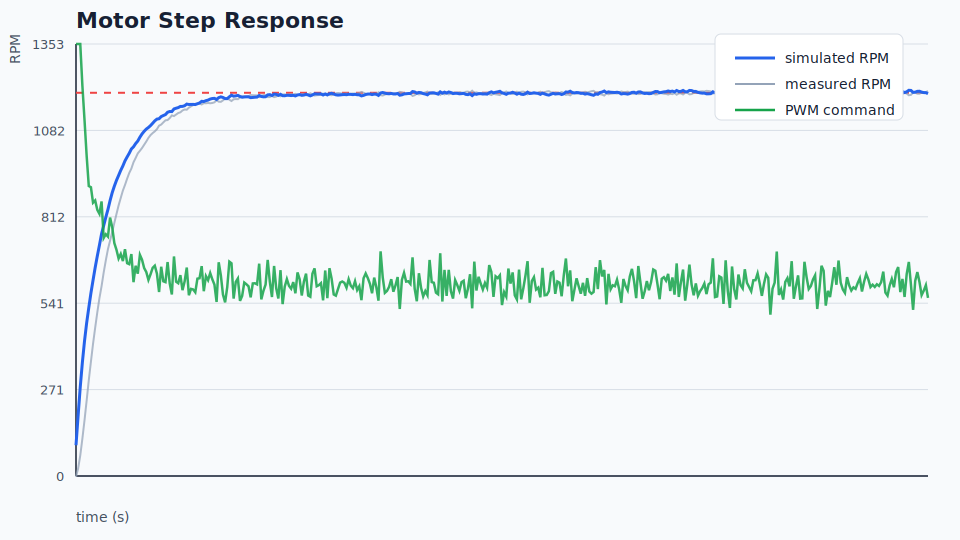

# Control Lab Toolkit

A small controls and embedded-systems lab for practicing motor control ideas
before flashing hardware. It includes a PID controller, a first-order motor
plant simulator, sensor filtering, CSV telemetry, a command-line experiment
runner, SVG plotting, and an Arduino-compatible firmware sketch.

The project is intentionally classroom-sized: it is compact enough to explain
in an interview, but complete enough to show testing, documentation, and
hardware-aware thinking.

## Features

- Discrete PID controller with output clamping and anti-windup
- First-order DC motor speed model with saturation and load disturbance
- Exponential moving average filter for noisy sensor readings
- CLI experiment runner that exports telemetry to CSV
- SVG step-response plots that render directly on GitHub
- Unit tests for controller behavior and simulation stability
- Arduino sketch showing how the same control loop maps to firmware

## Quick Start

```bash
python3 -m venv .venv
source .venv/bin/activate
python -m pip install -e .
python -m control_lab simulate --target-rpm 1500 --seconds 4 --csv examples/run.csv --plot examples/run.svg
python -m unittest
```

## Example

```bash
python -m control_lab simulate --target-rpm 1200 --load 0.12 --noise 15
```

Sample output:

```text
target_rpm=1200.0 final_rpm=1192.4 overshoot=3.8% settling_time=1.42s
```

## Plotting

The simulator can write an SVG chart that GitHub previews without extra tools:

```bash
python -m control_lab simulate --target-rpm 1200 --load 0.10 --noise 10 --csv examples/run.csv --plot examples/run.svg
```

You can also render a plot from an existing CSV:

```bash
python -m control_lab plot examples/run.csv --target-rpm 1200 --output examples/run.svg
```



## Project Structure

```text
src/control_lab/          Python package
tests/                    Unit tests
firmware/                 Arduino control-loop example
docs/                     Notes on tuning and lab workflow
examples/                 Generated CSV runs and sample commands
```

## References

This project is original practice code. It is designed around standard control
concepts commonly found in motor-control labs:

- PID control with anti-windup
- First-order system identification
- PWM command saturation
- Noisy sensor filtering
- Serial telemetry for debugging embedded systems
